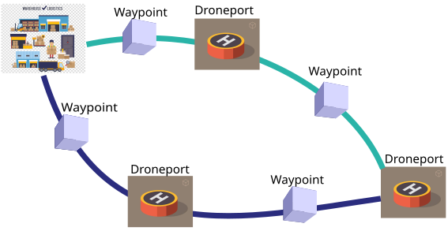

# Drone Deliveries Tracking Using A Blockchain Approach

### Problem Description

E-commerce companies like amazon have being investing heavily on designing drones to deliver items from the warehouse to people's houses. This poses a challenge on how to efficiently track drones from the warehouse/store, to the destination and back with the major setback being orchestration between autonomous drones from different companies within the same airspace.

### Overview, Purpose and boundaries of the Network

The network assumes a manned aviation approach in solving this problem. Aircrafts have a transponder that communicates various information about the aircraft to air traffic controllers(ATC) during flight. Additionally, pilots perform position reports at various set waypoints along their reported flight path. This way, the ATC is aware of the aircraft's position, destination and estimated time of departure. Aircrafts mostly use airways, which can be imagined as roads in the air. Within these 'roads' lie waypoints where pilots have to report on their arrival.

    

This concept tackles aims to use the manned aviation approach to make drone delivaries tracking more reliable. Each warehouse and droneport is also treated as a waypoint. The drone while flying the routes will be broadcasting its position every time during flight. Whenever it reaches a waypoint, the journey(from waypoint to waypoint) is added to the network. The total fee

For meeting the requirements of the task, it is assumed that the drones using the network have a mechanism that mimics the transponder's behaviour. This digital transponder thus holds the relevant keys for the drone. It is also assumed that the drones will only follow these routes which have physical waypoints that receive the drone's transponder signal. A transaction would thus be represented by a completed journey between the drone and the physical waypoint.

This approach would increase the safety and integrity of delivery networks by introducing a protocol that uses blockchain.

### Interaction Within Network and Potential

The system is comprised of a droneport(An area where drones can take off and land. This can be a warehouse, a store or a point in an estate or apartment for dropping the items), digital landmarks(A computer placed along a route for purposes of handling position reports). In an ideal situation, the drone takes off from a droneport or a warehouse with a set route to a specific destination. At each waypoint, the drone's activity is saved as a transaction within the network. By the use of a wallet designed to read transactions from this network, the drone's flight can be tracked.

This opens up a ton of capabilities for the drones industry to catch up on the manned aviation industry. This design can help many companies introduce their own drones within the airspace since they will all be using one route. It may also lead to a new design of Unmanned Traffic Management Systems that allow for near autonomity since the bulk of the work will be handled by the network. It may also lead to cheaper surveillance of drones within the airspace (Assuming the waypoints have a way to tell registered drones from unregistered drones)

### Security Requirements

1. Immutability of transactions. Once a journey has been recorded, just like in the manned industry, it cannot be erased from the network's history.
2. An intruder should not be able to recreate an imaginary drone or try to spoof another drone's identity without the network detecting this.

### Characteristics of Users

1. Delivery companies.
   a. They own the drones that have registered transponders.
   b. They have a computer that acts as a waypoint.
2. Droneports
   a. They have a computer that acts as a waypoint.
